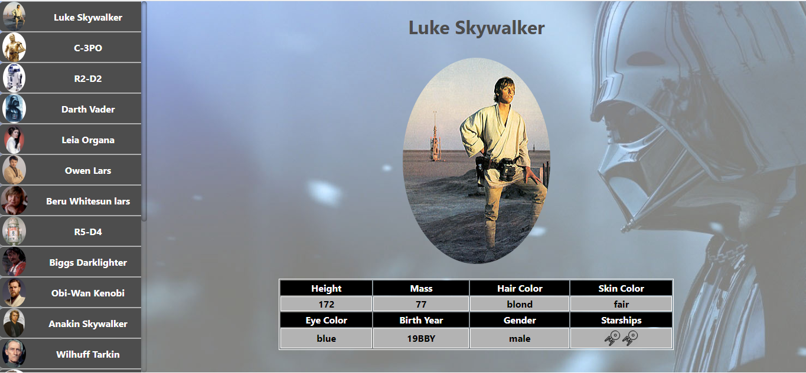
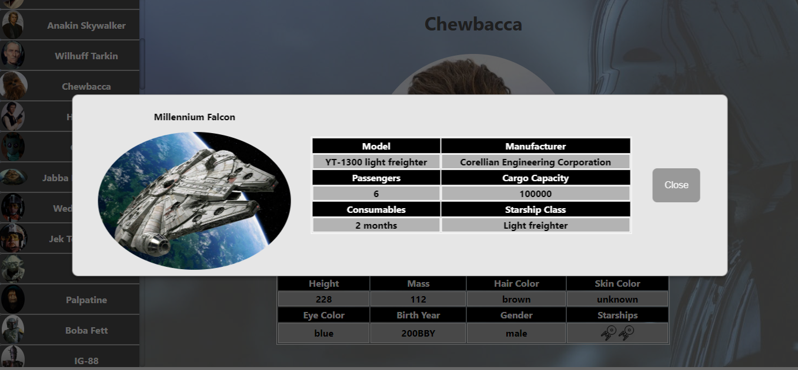

# Challenge Invillia - Teste FrontEnd que faz uso de uma API já existente(Personagens Star Wars) para exibição dos dados (desenvolvido com React)

O projeto de Front foi criado com o auxílio do [Create React App](https://pt-br.reactjs.org/docs/create-a-new-react-app.html), fazendo uso de [React Hooks](https://pt-br.reactjs.org/docs/hooks-intro.html), bem como, de componentes de classe, em alguns momentos recebendo o estilo por parametro e em outros, tendo seu próprio arquivo de estilo, de forma a diversificar possibilidades de implementação da solução.

Devido ao tempo reduzido para a execução dos testes, alguns requisito não foram tratados, sendo:

- Testes unitários: Foram implementados, porém de forma simplista, sendo necessário uma maior cobertura para adequação, entretanto, com a implementação realizada já é possível avaliar este requisito.

- Testes e2e: Requisito não tratado na solução (uma alternativa seria subir um ambiente utilizando docker com a aplicação e cobrir os cenários de testes com por exemplo, as ferramentas robot + selenium)
  
- Responsividade: Este requisito foi completamente ignorado, sendo trabalhado com base em uma única resolução (para a implementação iria utilizar css com @media, seguindo o princípio de mobile first, cobrindo todas as faixas de resolução comumente encontradas).
  
- Paginação: Foi considerada na solução fazendo um do recurso de scroll infinito, com carregamento por demanda.
  
- UI/UX: Considerados na resolução, entretanto, não foram aplicados todos os princípios e conceitos necessários para a aplicação ser considerada aderente.
  
- Imagens dos personagens: Item considerado e implementado na solução.

Outros fatores como internacionalização, acessibilidade, comentários de código, padronização/tratamento de mensagens de erro, padronização (esta de forma proposital para ilustrar formas distintas de utilização do framework), apesar de não estarem explicitamente citados como requeridos, mas também importantes, foram desconsiderados devido a restrição do tempo para implementar a solução.

Os seguintes componentes foram desenvolvidos:

> - cardItem >
Elemento quer irá exibir as informações de um determinado personagem (imagem e características físicas fornecidas pela API).

> - cardItemMenu >
Apresenta o identificador do personagem (apenas imagem e nome) para que seja clicado, disparando assim, a exibição dos detalhes daquele personagem representado pelo mesmo.

> - cardMenu >
Apresenta o agrupamento dos elementos cardItemMenu em forma de listagem contínua (aqui é utilizado o recurso de scroll infinito), permitindo a rolagem para que o usuário escolha qual personagem quer visualizar.

> - starShipModal >
Apresenta uma especie de card especívido para as naves que é exibido somente para os personagens que possuem a relação com alguma.

> - model >
Tela em formato model que contém os dados do starShipModal que será apresentado.

Por padrão, o sistema irá executar localmente na seguinte url: http://localhost:3000), sendo:

**Tela principal do sistema:**


**Detalhes de uma nave sendo exibidos:**


## Instalação para desenvolvimento (ambiente e execução)

Necessários o seguinte para a correta execução:

- Instalação do Node.js, [clique aqui para as instruções](https://nodejs.org/en/download/)

- Após instalado, abrir um console e digitar:

  * Instalar as dependencias do projeto com: `npm install`
  * Executar o projeto `npm run start`
  Após isto, o mesmo poderá ser observado na seguinte url [`localhost:3000`](http://localhost:3000) no browser correspondente (homologação realizada para as versões recentes do Chrome apenas).

## Execução dos testes

Considerando que o ambiente já esteja configurado conforme instruções anteriores, digite o seguinte em um console do projeto:

```shell
npm run test
```

Será executado o script de testes do projeto (testes dos componentes individuais e teste do fluxo principal de simulação). 

Os testes fazem uso de mock, e também fazem acesso direto na API, sendo necessário que a mesma esteja acessível para a execução dos mesmos execução dos mesmos.

Um relatório html com detalhes da execução pode ser observado na pasta "coverage", na raiz do projeto.
